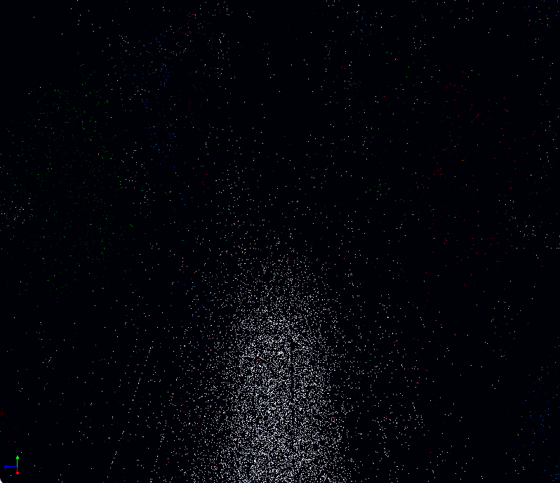

World Space ReSTIR in Vulkan
================

**University of Pennsylvania, CIS 565: GPU Programming and Architecture, Final Project**

* Zhiyi Zhou
  * [[GitHub](https://github.com/zhiyi1801)] [[LinkedIn](https://www.linkedin.com/in/%E5%B8%9C%E4%B8%80-%E5%91%A8-10548328b/)].
* Jichu Mao
  * [[GitHub](https://github.com/jichumao)] [[LinkedIn](https://www.linkedin.com/in/jichumao/)].

## Introduction

This repository contains our implementation of [**World-Space Spatiotemporal Path Resampling for Path Tracing**](https://wangningbei.github.io/2023/ReSTIR.html) with Vulkan Raytracing. Our base code is from [Nvidia's Vulkan raytrace renderer](https://github.com/nvpro-samples/vk_raytrace/tree/master). 

The rendering pipeline can be switched from:
* **Ray Tracing Pipeline**: RayGen, Closest-Hit, Miss, Any-Hit model
* **Ray Query**: Compute shader using Ray Queries
* **ReSTIR**: Our World Space ReSTIR implementation.

## Setup

~~~~ 
git clone https://github.com/zhiyi1801/CIS-565-2024Fall-Final.git
cd ./CIS-565-2024Fall-Final
mkdir build
cd ./build
cmake ../
~~~~

- Unlike the original Nvidia's Vulkan raytrace renderer, which requires you to separately clone the nvpro_core library and the renderer itself, we’ve simplified the process by bundling these dependencies directly into this repository. This eliminates the need for additional steps—just clone and build.

- We recommend to use Visual Studio 2022 to develop this project.

### Controls

| Action | Description |
|--------|-------------|
|`LMB`        | Rotate around the target|
|`RMB`        | Dolly in/out|
|`MMB`        | Pan along view plane|
|`LMB + Shift`| Dolly in/out|
|`LMB + Ctrl` | Pan |
|`LMB + Alt`  | Look around |
|`Mouse wheel`| Dolly in/out |
|`Mouse wheel + Shift`| Zoom in/out (FOV)
|`Space`| Set interest point on the surface under the mouse cursor.
|`F10`| Toggle UI pane.
|Drag and drop glTF files (`.gltf` or `.glb`) into viewer|Change glTF model
|Drag and drop HDR files (`.hdr`) into viewer|Change HDR lighting

## Pipeline Overview

**1. G-Buffer & Initial Sampling Pass**

This stage generates the G-buffer and initial path samples. The G-buffer captures essential scene data such as surface positions, normals, and material properties. Rays are then traced to determine intersections with the scene geometry, producing the initial lighting contributions and PDF values for path samples. These samples form the basis for later resampling, ensuring a solid start for the rendering pipeline.

**2. Hash Grid Construction Pass**

Path samples generated in the previous stage are organized into a world-space hash grid. This grid uses both position and normal data to group similar samples efficiently. The grid employs an adaptive cell size, with finer granularity for closer regions and coarser for distant areas, optimizing memory usage and computational efficiency.

**3. Spatiotemporal Resampling Pass**

In this critical stage, path samples are reused across frames and spatially from neighboring pixels. Temporal resampling utilizes samples from the previous frame, while spatial resampling retrieves samples from the hash grid, validating them based on similarity metrics like normals and visibility. This dual-domain reuse significantly improves rendering quality while maintaining real-time performance.

**4. Final Shading Pass**

Resampled path data is used to compute the final pixel colors. This involves evaluating BSDFs and integrating the direct and indirect illumination contributions. The result is a high-quality representation of global illumination, even under low sampling rates.

**5. Post-Processing Pass**

The final stage applies post-processing effects such as tone mapping, denoising, and anti-aliasing to enhance the visual quality of the rendered image. These effects ensure a polished and visually pleasing result.

For each pixel, primary rays are cast from the camera into the scene, intersecting geometry to generate visible points. At these points, the ray direction and material properties determine the continuation of the path. Paths are classified based on surface roughness, separating interactions into specular (smooth) and diffuse (rough) types. This classification simplifies the handling of reflection and refraction in subsequent passes.

To ensure efficiency, we optimize path sampling by leveraging importance sampling for BSDF evaluation. This step reduces noise in areas with high-frequency lighting changes or glossy surfaces. Initial sampling lays the foundation for resampling by capturing critical lighting and geometric information while minimizing computational overhead.

## Algorithm Details

### Initial Sampling 

In the **Initial Sampling stage**, we combine G-buffer generation with Monte Carlo path tracing to prepare initial path samples. The G-buffer stores essential attributes such as surface positions, normals, and material IDs, which are crucial for guiding resampling and shading.

For each pixel, primary rays are cast from the camera into the scene, intersecting geometry to generate visible points. At these points, the ray direction and material properties determine the continuation of the path. Paths are classified based on surface roughness, separating interactions into specular (smooth) and diffuse (rough) types. This classification simplifies the handling of reflection and refraction in subsequent passes.

To ensure efficiency, we optimize path sampling by leveraging importance sampling for BSDF evaluation. This step reduces noise in areas with high-frequency lighting changes or glossy surfaces. Initial sampling lays the foundation for resampling by capturing critical lighting and geometric information while minimizing computational overhead.

### Hash Grid Construction

The Hash Grid Construction stage organizes the path samples generated in the previous step into a spatially coherent structure. This world-space hash grid supports efficient queries and reuse of path samples during spatial resampling.

Unlike screen-space buffers, the hash grid uses both position and normal data to define unique keys for each sample. This normal-aware hashing ensures that samples with similar spatial and angular characteristics are grouped together, even in scenes with complex geometries or high-frequency normal variations. The hash grid's cascaded structure dynamically adjusts cell sizes based on camera distance. Near-camera regions are represented with smaller cells to preserve detail, while distant regions use coarser cells to save memory and computation.

The hash grid visualization demonstrates how the grid partitions a scene like `robot-toon` and `Sponza`, with distinct colors representing different cells. Samples within each cell share similar spatial and angular properties, making them ideal candidates for spatial reuse. This adaptive strategy reduces artifacts and improves the coherence of indirect lighting contributions in subsequent resampling stages.

 |  |  |
|:--:|:--:|
| *robot-toon* | *Sponza* |

### World Space ReSTIR DI

The **World Space ReSTIR DI (Direct Illumination)** stage enhances direct lighting calculations by leveraging the hash grid for sampling light sources efficiently. Traditional path tracing methods shoot shadow rays for each light source, leading to high computational costs, especially in scenes with numerous lights. ReSTIR DI mitigates this by caching and reusing light samples across multiple bounces and frames.

For each path, light samples are stored in the hash grid, categorized by their position and normal. During shading, the cached light samples are queried and evaluated based on their contribution. This approach allows our method to handle complex lighting scenarios, such as highly glossy surfaces or distant illumination sources, with minimal bias and noise.

The GIF below showcases how light sampling evolves dynamically across frames. By reusing samples efficiently, our method achieves stable, noise-free results under varying lighting conditions, outperforming traditional methods in both quality and performance.

 |  |
|:--:|
| *World Space ReSTIR DI* | 

### Spatiotemporal Resampling

The Spatiotemporal Resampling stage is the core of our pipeline, responsible for reusing path samples across both spatial and temporal domains. Temporal reuse projects path samples from previous frames into the current frame using motion vectors derived from the camera's transformation matrices. This ensures that stable lighting contributions persist over time, even under dynamic conditions. Samples that are occluded or deviate significantly are discarded to avoid artifacts.

Spatial reuse involves querying the hash grid for neighboring samples that share similar positions and normals. To validate these candidates, we apply thresholds for angular similarity and depth variation. Samples that pass these criteria are integrated into the reservoir, weighted by their contribution to the shading.

 |  |
|:--:|
| *Spatiotemporal Resampling* | 

The effectiveness of spatiotemporal resampling is illustrated through the temporal & spatial reuse results. Compared to single-sample-per-pixel (SPP) path tracing, our method significantly reduces noise and achieves higher-quality indirect illumination, as seen in the Sponza scene under 1 SPP.

 |  |  |
|:--:|:--:|
| *Ours* | *Path Tracing* |

Further analysis of rough surfaces and smooth surfaces demonstrates how our method adapts to varying material properties. For rough surfaces, spatial reuse effectively gathers contributions from a larger neighborhood, while for smooth surfaces, temporal reuse ensures stable reflections and specular highlights. This flexibility is a key advantage of our approach.

 |  |  |
|:--:|:--:|
| *Ours(Rough Surface)* | *Path Tracing(Rough Surface)* |

 |  |  |
|:--:|:--:|
| *Ours(Smooth Surface)* | *Path Tracing(Smooth Surface)* |

Finally, the World Space ReSTIR GI gif combines all stages of the pipeline, including indirect illumination. The final output demonstrates how our method handles both direct and indirect lighting seamlessly, achieving real-time performance with minimal bias and noise.

 |  | 
|:--:|
| *World Space ReSTIR GI* | 

### Open Image Denoiser(OIDN) Integration

To enhance the visual quality of the final rendered images, we integrated Intel's Open Image Denoiser (OIDN) into our pipeline. OIDN uses deep learning to effectively remove noise from path-traced images, leveraging auxiliary data such as Albedo and Normal from the G-buffer along with the noisy Color output from the final shading pass. The result is a clean and visually appealing image that retains surface details and shading accuracy.

 |  | 
|:--:|
| *OIDN Denoise Process* | 

While the denoising significantly improves image quality, its current implementation on the CPU introduces performance challenges. Each denoising step adds approximately 250ms per frame, which heavily impacts the real-time performance of the system. This bottleneck highlights the need for optimization, and we are actively exploring GPU-based acceleration to mitigate this issue and make the denoising process more efficient for interactive applications.

## Performance Analysis

### Test Environment

The test was conducted on:

- Windows 11, i7-13700K @ 3.40 GHz, 32GB, RTX 4090 24GB
- Visual Studio 2022
- Test Scenes : garage scene with 3078 triangles, sponza scene with 262, 267 triangles and robot-toon scene with 115, 9994 triangles.
- Benchmark: Rendering time per frame for each pass in milisecond.

### Result 

From the benchmark results, the initial sampling and G-buffer generation stages dominate the per-frame cost across different scene complexities. This is expected because these steps involve full-scene ray intersections and G-buffer output for every pixel, both of which scale with geometry complexity and scene coverage. In scenes with high triangle counts (e.g., Sponza or robot-toon), more rays intersect more detailed meshes, increasing the overhead of geometry traversal and intersection tests. This cost is significantly higher compared to subsequent stages, where the data primarily resides in readily accessible buffers or spatial structures.

The hash grid construction, while influenced by the viewpoint and scene layout, exhibits relatively stable timings. This suggests that once the initial samples and G-buffer data are established, the hashing process—keyed by position and surface orientation—incurs a more consistent cost. Variations arise primarily from how densely samples cluster in certain areas of the scene, but the hashing mechanism itself scales predictably and does not balloon with scene complexity as dramatically as initial ray intersections do.

Resampling timings show modest differences and remain relatively low. This indicates that the spatial and temporal lookups in the hash grid, as well as sample validation and weighting, are efficient. The process depends more on well-structured data from previous passes than on scene complexity, which keeps execution times stable.

The final shading and post-processing phases are almost invariant to scene complexity. These steps rely mostly on evaluating a known set of samples and applying lightweight image-space operations. Their runtime is closely tied to screen resolution and the complexity of the shading models, rather than to raw geometric density. Consequently, once the samples are established and refined, these passes remain a minimal overhead portion of the pipeline.

In summary, the observed performance distribution is driven mainly by the heavy geometric work upfront (initial sampling and G-buffer generation). Subsequent passes benefit from efficient spatial data structures and their reduced dependence on geometric complexity, resulting in more stable and predictable timing profiles across different scenes.

## Timeline
*Click on the title for slides*
- [Pitch](imgs/Pitch.pdf) 
- [Milestone 1(Nov 13)](imgs/Milestone1.pdf)
  - Basic Vulkan Ray-Tracing Pipeline Setup in Vulkan
  - Light source importance sampling for both environment map and mesh lights
  - Hash Grid Data Structure Setup
  - Research on RIS(Resampled Importance Sampling), Reservoir-based sample Algorithm, and Denoise techs

- [Milestone 2(Nov 25)](imgs/Milestone2.pdf)
  - Completed hash grid Construction & Visualization
  - Completed World Space ReSTIR Direct illumination
  - Completed basic Open Image Denoiser integration

- [Milestone 3(Dec 02)](imgs/Milestone3.pdf)
  - Completed basic Spatial Reuse
  - Fixed bugs for Temporal Reuse 
  - Fixed several bugs for DI
  - Project refactoring and code optimization 

## Limitations and Future Plan

-  Currently we find that noise reduction in OIDN leads to severe rendering performance degradation, and we expect to upgrade the noise reduction method in the future.

- We have found through our project that ReSTIR may not be suitable for indirect lighting calculations, as we are essentially doing a spp sample each time during resampling, and it may be more efficient for GI to use methods such as Surfel

## References
* [glTF format specification](https://github.com/KhronosGroup/glTF)
* [glTF Sample Models](https://github.com/KhronosGroup/glTF-Sample-Models)
* [tiny glTF library](https://github.com/syoyo/tinygltf)
* [Ray Tracer Tutorial](https://github.com/nvpro-samples/vk_raytracing_tutorial_KHR)
* [Vulkan ray tracing](https://www.khronos.org/blog/vulkan-ray-tracing-final-specification-release)
* [glTF 2.0](https://www.khronos.org/gltf/)
* [ray tracing tutorial](https://github.com/nvpro-samples/vk_raytracing_tutorial_KHR)
